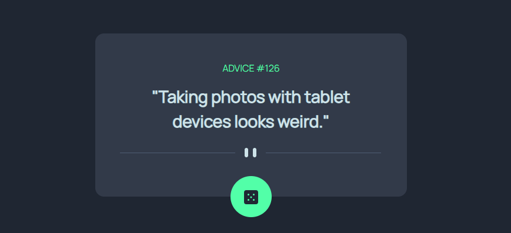
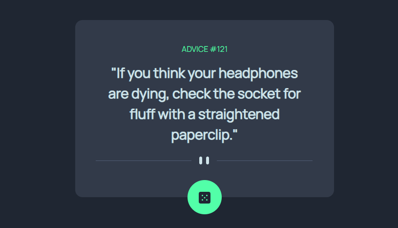

# Frontend Mentor - Advice generator app solution

This is a solution to the [Advice generator app challenge on Frontend Mentor](https://www.frontendmentor.io/challenges/advice-generator-app-QdUG-13db). Frontend Mentor challenges help you improve your coding skills by building realistic projects.

## Table of contents

- [Overview](#overview)
  - [The challenge](#the-challenge)
  - [Screenshot](#screenshot)
  - [Links](#links)
- [My process](#my-process)
  - [Built with](#built-with)
  - [What I learned](#what-i-learned)
  - [Useful resources](#useful-resources)
- [Author](#author)

## Overview

### The challenge

Users should be able to:

- View the optimal layout for the app depending on their device's screen size
- See hover states for all interactive elements on the page
- Generate a new piece of advice by clicking the dice icon

### Screenshot

### Links

- Live Site URL: [Github pages](https://calebomondi.github.io/advice-generator/)

## My process

### Built with

- Semantic HTML5 markup
- CSS custom properties
- Bootstrap 5
- JS Ajax
- [Google fonts](https://fonts.googleapis.com/css?family=Manrope) - For font styles

### What I learned

In JavaScript, AJAX (Asynchronous JavaScript and XML) is a technique that allows you to send and receive data from a server asynchronously without needing to reload the entire web page. AJAX enables you to build dynamic and interactive web applications by making HTTP requests in the background and updating specific parts of the page with the response data.

### Useful resources

- [W3 Schools](https://www.w3schools.com/js/js_ajax_intro.asp) - I was able to learn how to write and use the ajax code in JS to send and receive data from the server.

## Author

- Frontend Mentor - [@calebomondi](https://www.frontendmentor.io/profile/calebomondi)
- Twitter - [@kalebmokua_](https://www.twitter.com/kalebmokua_)
